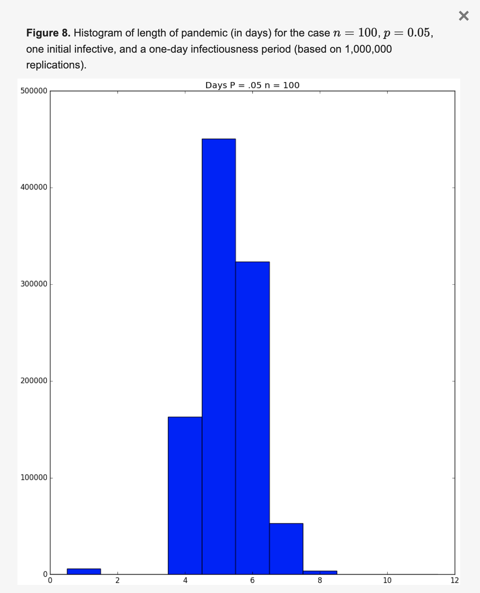
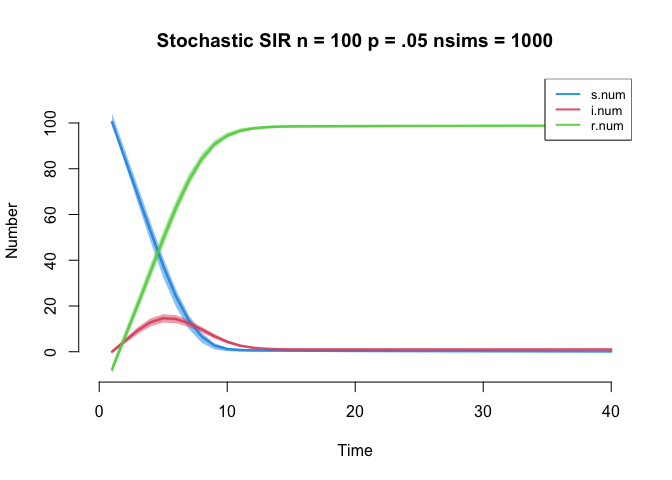
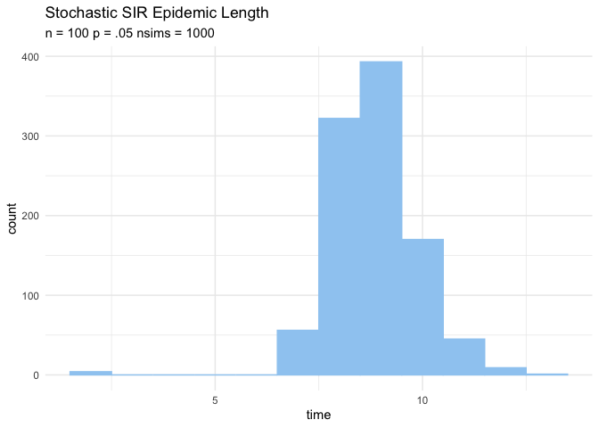
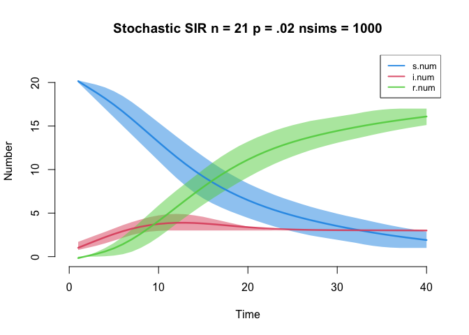
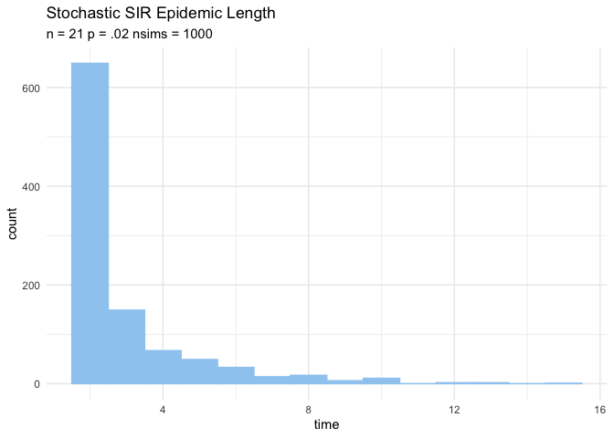

SIR Flu Simulation
================

``` r
suppressPackageStartupMessages(library(EpiModel))
```

    ## Warning: package 'EpiModel' was built under R version 4.1.2

    ## Warning: package 'deSolve' was built under R version 4.1.2

    ## Warning: package 'networkDynamic' was built under R version 4.1.2

    ## Warning: package 'network' was built under R version 4.1.2

    ## Warning: package 'tergm' was built under R version 4.1.2

    ## Warning: package 'ergm' was built under R version 4.1.2

    ## Warning: package 'statnet.common' was built under R version 4.1.2

``` r
suppressPackageStartupMessages(library(knitr))
suppressPackageStartupMessages(library(dplyr))
suppressPackageStartupMessages(library(ggplot2))
set.seed(97)
```

## Stochastic Model n = 100, p =.05, infectious period = 1 day (model1)

Below is a stochastic SIR flu simulation using the R package EpiModel.
The model is first validated by replicating a published, peer-review
model.

In the paper, Green Simulation of Pandemic Disease Propagation
(Wilson,et al., 2019), a stochastic SIR model with the parameters n =
100, p = .05, and an infectious period lasting exactly one day yeilds
the following distribution of pandemic lengths after 1,000,000
replications.

<!-- -->
<https://www.mdpi.com/2073-8994/11/4/580/htm>

The model below seeks to replicate the paper’s result.

-inf.prob is the probability of infection for each interaction with
infected agent -act.rate is set to n-1 to ensure each agent interacts in
every simulation -rec.rate is a vector assigning the probability of
recovery for each day in the length of infection -s.num is number of
susceptible sgents set to n-1 -i.num is the number of initially infected
agents -r.num is the number of initially recovered/immune agents
-n.steps is the amount of days in the simulation -nsteps is the number
of days in eacj simulation -nsims is the number of simulations

Model:

``` r
param1 <- param.icm(inf.prob = .05, act.rate = 99, rec.rate = c(0,1)) 
init1 <- init.icm(s.num = 99, i.num = 1, r.num = 0)
control1 <- control.icm(type = "SIR", nsteps = 40, nsims = 1000)
model1 <- icm(param1, init1, control1)
```

Time-series plot S, I, and R

``` r
plot(model1, main = paste("Stochastic SIR n = 100 p = .05 nsims = 1000"))
```

<!-- --> Plot
epidemic length:

``` r
# df of epidemic end date for each simulation based on si.flow = 0
df_end <- as.data.frame(model1) %>% 
  filter(si.flow == 0) %>% 
  group_by(sim) %>% 
  summarise(time = min(time[time != min(time)])) 
# Second occurrence of si.flow = 0. The first is in the initial state.

ggplot(df_end, aes(x = time)) + 
  geom_histogram(binwidth=1, color = "#9eccf2", fill= "#9eccf2")+
  labs(title = "Stochastic SIR Epidemic Length",
       subtitle = "n = 100 p = .05 nsims = 1000")+
  theme_minimal()
```

<!-- -->

## Stochastic SIR Model n = 21, p =.02, infectious period = 3 days (model2)

Below is the same stochastic model with parameters from the project
prompt.

Model:

``` r
param2 <- param.icm(inf.prob = .02, act.rate = 20, rec.rate = c(0,0,0,1)) 
init2 <- init.icm(s.num = 20, i.num = 1, r.num = 0)
control2 <- control.icm(type = "SIR", nsteps = 40, nsims = 1000)
model2 <- icm(param2, init2, control2)
```

Time-series plot S, I, and R

``` r
plot(model2, main = "Stochastic SIR n = 21 p = .02 nsims = 1000")
```

<!-- --> Plotting
Pandemic Length:

``` r
# df of epidemic end date for each simulation based on si.flow = 0
df_end <- as.data.frame(model2) %>% 
  filter(si.flow == 0) %>% 
  group_by(sim) %>% 
  summarise(time = min(time[time != min(time)])) 
# Second occurrence of si.flow = 0. The first is in the initial state.

ggplot(df_end, aes(x = time)) + 
  geom_histogram(binwidth=1, color = "#9eccf2", fill= "#9eccf2")+
  labs(title = "Stochastic SIR Epidemic Length",
       subtitle = "n = 21 p = .02 nsims = 1000")+
  theme_minimal()
```

<!-- -->

## Deterministic SIR Model n = 21, p =.02, infectious period = 3 days (model3)

Below is the same model parameters from the project prompt in a
deterministic model that uses dsolve()

``` r
param3 <- param.dcm(inf.prob = .02, act.rate = 20, rec.rate = 1/3) 
#rec.rate must be reciprocal of duration for deterministic models
init3 <- init.dcm(s.num = 20, i.num = 1, r.num = 0)
control3 <- control.dcm(type = "SIR", nsteps = 40, dt = 1)
model3 <- dcm(param3, init3, control3)
```

Time-series plot S, I, and R

``` r
plot(model3, main = "Deterministic SIR n = 21 p = .02 nsims = 1000")
```

<!-- -->
